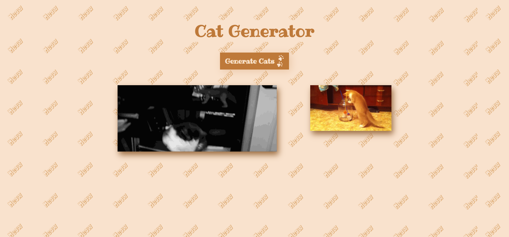

# Cat Generator

A random cat gif generator website.
 
 ## Functionality
 
 User clicks on the Generate Cat button to randomly generate a cat gif.  
 Every time the user clicks on the button a completely new cat gif is displayed.  
 To remove all the cat gifs displayed, the user has to reload the web page.  
 The cat gifs displayed are fetched from [TheCatApi](https://docs.thecatapi.com/)  
 
## Technologies Used

Technologies used in this project are HTML, SCSS and vanilla JavaScript.

## Link

- [Live Site URL](https://afreenalam198.github.io/catGenerator)

## Screenshot

